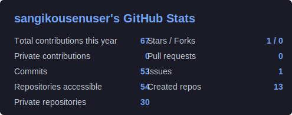
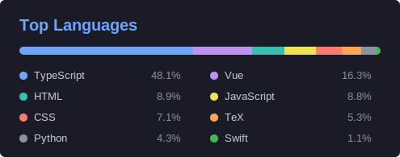

<h1 align="center">Hi, I'm sangikousenuser</h1>
<h3 align="center">Full-stack developer crafting web, mobile, cloud, and creative experiences.</h3>

  
  

## Tech Stack

### Frontend

  
  
  
  
  
  
  
  
  
  
  

### Mobile and Desktop

  
  
  
  
  

### Backend and Languages

  
  
  
  

### Databases and Data

  
  
  
  
  

### DevOps, Cloud and Infrastructure

  
  
  
  
  
  
  
  
  

### Tools and Platforms

  
  
  
  
  

### Design and Creative

  
  
  
  
  
  

## GitHub Stats

  
  

<!--
Private repository activity is reflected by GitHub Actions.
Set PROFILE_GITHUB_TOKEN in repository secrets with a GitHub token that can read private repositories.
-->

-----
Credits: [sangikousenuser](https://github.com/sangikousenuser)

Last Edited on: 08/07/2026
